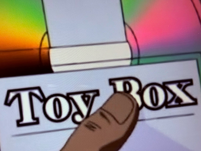

# toybox

This repository is what is called a `sandbox`.




## Play!

The following command creates a new empty orphan branch named `playing-with-a-new-toy`

```console
./play.sh playing-with-a-new-toy
```
